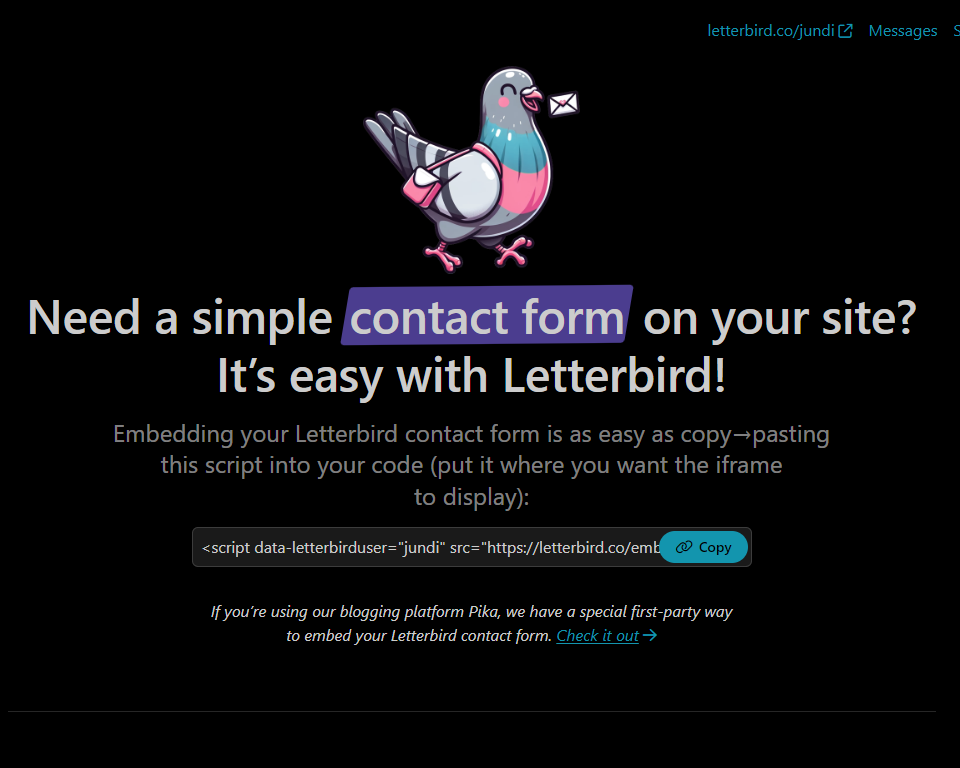
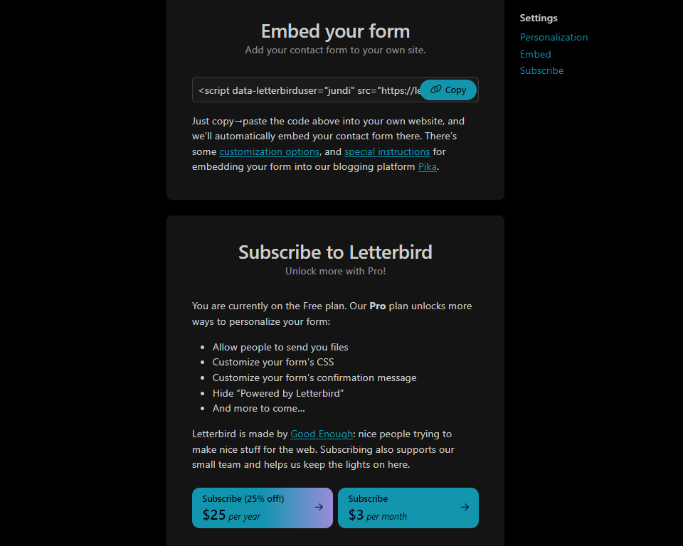
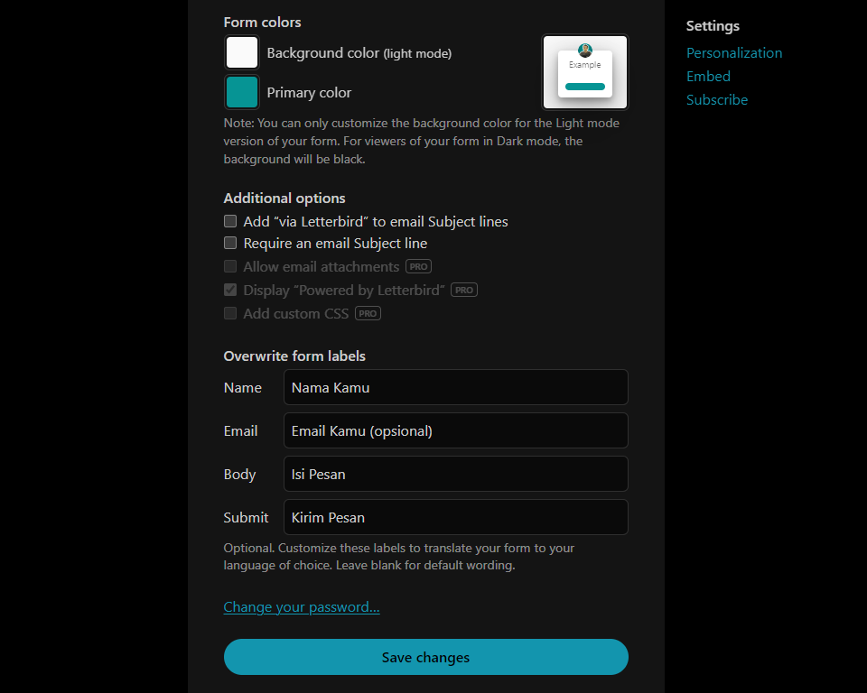
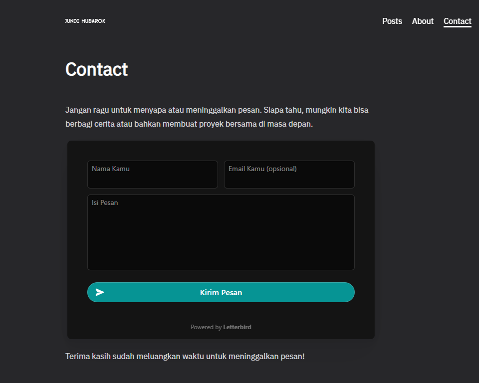

Saat ini saya menggunakan website statis dari hugo dan tidaklah semudah ketika ingin menambahkan form kontak supaya seseorang bisa dengan mudah menghubungi saya via email, karena pada hugo tidak ada plugin seperti wordpress yang bisa dengan menambahkankan form kontak.

Akhirnya secara tidak sengaja saya menemukan aplikasi form kontak ketika saya sedang berselancar di blog bule, dengan tampilan yang simpel dan tidak banyak fitur gimmick yang _useless_.

**Letterbird**, penamaan ini mungkin mengingatkan pada salah satu jenis burung merpati yang bisa mengirimkan surat dengan diikatkan pada kakinya, apalagi logo dari website ini memang menggunakan burung merpati sebagai maskotnya.

Hanya dengan menempelkan script pada website kita dan dengan sedikit kustomisasi letterbird menjadi lebih menarik dengan bagian header berisikan foto/logo dan "about me" yang bisa kita atur dengan mudah. Serta label form yang dapat kita atur isinya sesuai dengan selera.

Walaupun memilih paket yang free, letterbird ini tetap fungsional dengan fitur dasar yang sudah lebih dari cukup.

Kecuali untuk kamu yang suka dengan personalisasi lebih dalam, maka perlu upgrade ke plan yang lebih tinggi dan beberapa fitur premium akan terbuka, yaitu:

- Mengizinkan seseorang untuk mengirimimu berkas
- Custom form CSS
- Custom form pesan konfirmasi
- Sembunyikan "Powered by Letterbird"
- dan lainnya

Saat form contact disisipkan pada website, secara default header akan disembunyikan, cara untuk menampilkannya tambahkan `data-showheader = "true"` pada script.

Atau bisa lihat lebih lanjut pengaturannya di [link ini](https://letterbird.co/embed#customization)

Berikut contoh screenshoot letterbird yang sudah disisipkan di website pada halaman [contact](https://jundi.web.id/contact/), dan sengaja tidak saya tampilkan headernya supaya lebih simpel.\
Selamat mencoba!

